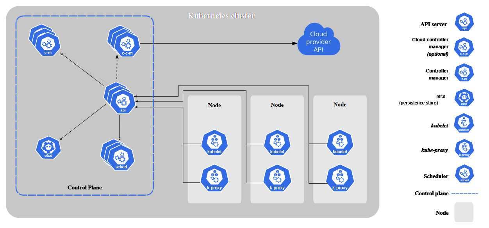

## Creation Date: 02-May-2025
## Owner  :  Shekhar
## Updated Date:
## Description:
    => kubernetes Componets

Source: https://kubernetes.io/docs/concepts/overview/components/

########################################################
Index:
  1. 

########################################################
## Kubernetes Components:

########################################################
## Core Components

A Kubernetes cluster consists of a control plane and one or more worker nodes. Here's a brief overview of the main components:

### Control Plane Components
Manage the overall state of the cluster:

kube-apiserver
    => The core component server that exposes the Kubernetes HTTP API

etcd
    => Consistent and highly-available key value store for all API server data

kube-scheduler
    =>Looks for Pods not yet bound to a node, and assigns each Pod to a suitable node.

kube-controller-manager
    => Runs controllers to implement Kubernetes API behavior.

cloud-controller-manager (optional)
    => Integrates with underlying cloud provider(s).

### Node Components
Run on every node, maintaining running pods and providing the Kubernetes runtime environment:

kubelet
    => Ensures that Pods are running, including their containers.

kube-proxy (optional)
    =>  Maintains network rules on nodes to implement Services.

Container runtime
    =>  Software responsible for running containers. Read Container Runtimes to learn more.

### Addons
 Addons extend the functionality of Kubernetes. A few important examples include:

DNS => For cluster-wide DNS resolution

Web UI (Dashboard) => For cluster management via a web interface

Container Resource Monitoring => For collecting and storing container metrics

Cluster-level Logging => For saving container logs to a central log store

########################################################
